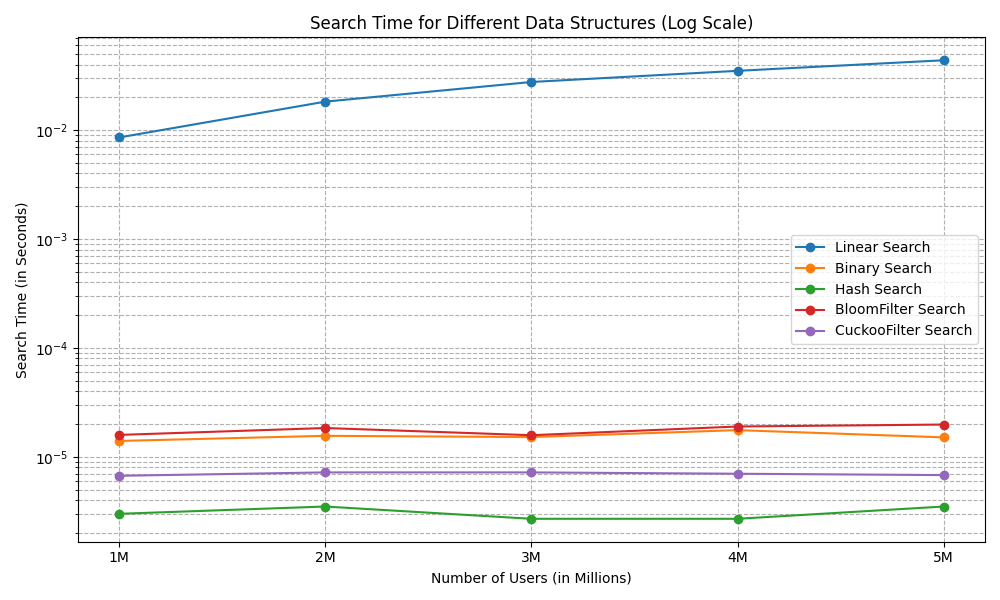

# The Login Checker Problem

## 🚀 Overview
This repository implements and compares **five different data structures** for checking the uniqueness of login usernames:
1. **Linear Search** (`O(n)`)
2. **Binary Search** (`O(log n)`)
3. **Hash Search** (`O(1)`)
4. **Bloom Filter** (`O(k)`)
5. **Cuckoo Filter** (`O(1)`)

We analyze the time complexity of each data structure and visualize their performance across different dataset sizes. Here, `n` is the number of usernames and `k` is the number of hash functions used in Bloom filters.

---

## **How to use**
### **Step 1: Generate and Store the Dataset**
- By running `datageneration.py` and changing parameter `NUM_USERS`, you can generate a dataset of any size, and all usernames in the dataset are unique.
- We generated a dataset containing 5 million usernames, which was stored in `usernames_5M.txt`.

### **Step 2: Initialize Filters**
- The **Bloom Filter** and **Cuckoo Filter** classes are implemented in `bloomfilter.py` and `cuckoofilter.py`, respectively.
- By running `filter_initializer.py`, you can instantiate both data structures and insert all generated usernames into the filters, allowing the main function to load them directly for search operations, thereby reducing runtime of main function.
- We stored our processed files in `bloom_filter_2.pkl` and `cuckoo_filter_2.pkl`.

### **Step 3: Test for a New Username**
- By running `A1_main.py`, you can test the search time for each of the five data structures.
- You can modify `cls.new_username` to test with any non-existent username.
- By adjusting the parameter `iii`, different dataset sizes can be selected for testing. In our experiment, we set the dataset size from 1 million to 5 million.

### **Step 4: Analyze and Visualize Performance**
- After recording the runtime of diffirent data strcutures, you can use `plot_run_time.py` to plot the results.
- The runtime of each data sructure is compared using different dataset sizes (1M to 5M usernames in our experiment).

`usernames_5M.txt`, `bloom_filter_2.pkl`, and `cuckoo_filter_2.pkl` can be downloaded from: https://drive.google.com/drive/folders/1v9Ps-4SwG667cAhpXedrtAvBoQwe3vNH?usp=drive_link.

## **Results**
Here is our runtime comparison for different data structures:

